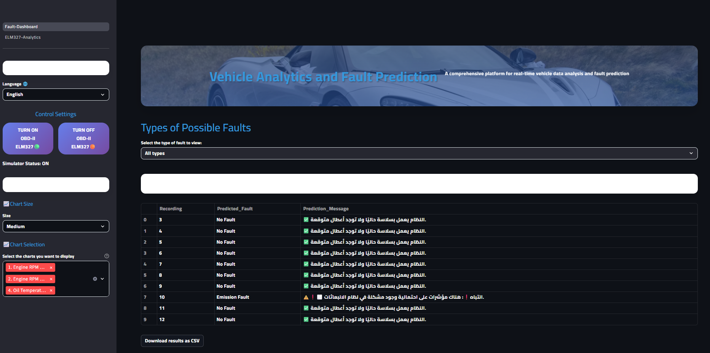

# Car Fault Prediction using OBD-II Data (Graduation Project)

An AI-powered system for real-time prediction and detection of car faults using OBD-II data streams.  
This project combines machine learning, data visualization, and real-time APIs to deliver an early warning system for vehicle malfunctions.

> 🏆 Graded A+ in our graduation evaluation.


---

## Introduction

Modern vehicles are equipped with an **OBD-II (On-Board Diagnostics)** system, a standardized interface that monitors the health and performance of the vehicle. It provides sensor data such as engine temperature, RPM, throttle position, and more.

Despite its availability, **most car owners and workshops don't utilize OBD-II data efficiently**. Diagnosis is often delayed until a major fault occurs. This project solves that problem.

---

## Problem Statement

Car owners and even many workshops rely on **manual diagnosis** or basic scanning tools that only read error codes after faults appear. There's a lack of intelligent systems that:

- Predict faults *before* they occur.
- Provide **real-time** analysis and warnings.
- Offer user-friendly dashboards or mobile alerts.

In short, there's a **gap** between raw car data and actionable intelligence.  
Our project bridges that gap.

---

## ⚙️ Challenges We Faced

- 🔧 **Access to realistic vehicle data:** OBD-II real-time data is hard to obtain. We had to simulate realistic readings using expert knowledge.
- 🛠️ **Workshop Collaboration:** Many repair garages are not equipped to provide clean datasets or structured logs.
-  **Model training:** Creating a generalizable model from noisy, domain-specific data.
- **Hardware constraints:** Testing the solution on real OBD-II devices like ELM327 with limited connectivity and reliability.
- **Push notifications and mobile integration:** Building a seamless app-to-backend connection for real-time alerts.

---

## 📌 Main Idea

The project aims to create an intelligent automotive assistant that predicts vehicle faults **before they occur** using sensor data from the OBD-II port.

- The system reads sensor data (like RPM, engine temp, etc.) from the vehicle.
- It analyzes the data in real time using a trained **machine learning model (XGBoost)**.
- If an issue is detected, it **stores the result**, **displays it on a dashboard**, and **sends an alert to the driver’s phone**.
- The mobile app integrates everything: **dashboard + chatbot assistant** for mechanical inquiries.
  
---

## 📁 Project Structure

```bash
CAR-FAULT-PREDICTION-OBD-II/
│
├── API and Prediction/                        # Backend API using FastAPI
│   ├── API.py                 # Main FastAPI app with endpoints
│   ├── predictor.py           # ML prediction logic
│   ├── SQLite.py              
│   ├── utilize.py             # Utilities and helper functions
│   ├── car_fault_classifier.json  # Trained XGBoost model
│   ├── encoders.pkl           # LabelEncoders used in training
│   ├── feature_columns.pkl    # Ordered feature list for model input
│   ├── Dockerfile
│   └── .env
│
├── UI/                        # Frontend using Streamlit/HTML/CSS
│   ├── Fault-Dashboard.py     # Main dashboard interface
│   ├── charts_module.py       # Charts & visualization logic
│   ├── pages/                 # Optional sub-pages for Streamlit
│   │    └── ELM327-Analytics  # Detailed analysis of vehicle data and prediction data.
│   └──  Dockerfile
│
├── Chatbot/                   # Future chatbot support (LLM assistant)
                               # Mechanic specializing in fine-tuning Qwen2.5B <Unsloth>
└──Mobile App/                 # Mobile app interface (Flutter/React Native)
   └── Allows full control of the system from a smartphone, including chatbots, payment, and turning the device ON and OFF - OBD-II ELM 327 device.
```

---

## 🚀 Features

- 🔌 **Real-time OBD-II Data Processing**
- 🤖 **AI Fault Prediction** using XGBoost classifier
- 📊 **Interactive UI** to visualize sensor data and fault alerts
- 🛠️ **Fault Database** to store all predictions historically
- 🌐 **RESTful API** for integration with any platform
- 📱 **Mobile App with Push Notifications** on fault detection
- 💬 **Built-in Chatbot** for user Q&A and mechanic guidance
- 🐳 **Dockerized** for clean deployment and portability

---

## 🧠 Model Details

- **Model Type:** `XGBoost Classifier`
- **Task:** Multi-class classification of fault types
- **Input Features:** 16 OBD-II signals (e.g., RPM, Temp, Pressure)
- **Output Classes:** Normal, Engine Fault, Transmission Fault, etc.
- **Preprocessing:** LabelEncoding, Feature Ordering
- **Performance:** 90%+ accuracy on test set

---

## 🔄 Data Flow Overview

1. 🚗 OBD-II Data is received from car sensors.
2. 📤 Sent to FastAPI via `/predict` endpoint.
3. 🤖 Processed by `predictor.py` using trained ML model.
4. 📥 Results stored in SQL via `SQLite.py and Postgres`.
5. 📲 If fault is detected, a **notification is sent to the user's mobile**.
6. 📈 Displayed in real-time using Streamlit dashboard (`UI/Fault-Dashboard.py`).
7. 💬 User can chat with the chatbot via mobile app for clarification.

---

## 🛠️ How to Run Locally

### 1. Clone the Repo
```bash
git clone https://github.com/Tarekys/CAR-FAULT-PREDICTION-OBD-II.git
cd CAR-FAULT-PREDICTION-OBD-II
```

### 2. Run API (FastAPI)
```bash
cd API
pip install -r ../UI/requirements.txt
uvicorn API:app --reload
```

### 3. Run UI (Streamlit)
```bash
cd ../UI
streamlit run Fault-Dashboard.py
```

---

## Docker Instructions
### Build and Run API
```bash
cd API
docker build -t obd-api .
docker run -p 8000:8000 obd-api
```

### Build and Run UI
```bash
cd ../UI
docker build -t obd-ui .
docker run -p 8501:8501 obd-ui
```

---

## References

- Chen, T., & Guestrin, C. (2016). *XGBoost: A Scalable Tree Boosting System*.
- Maklin, C. (2022). *Data Cleaning and Preprocessing for ML*.
- OBD-II Standard Docs

