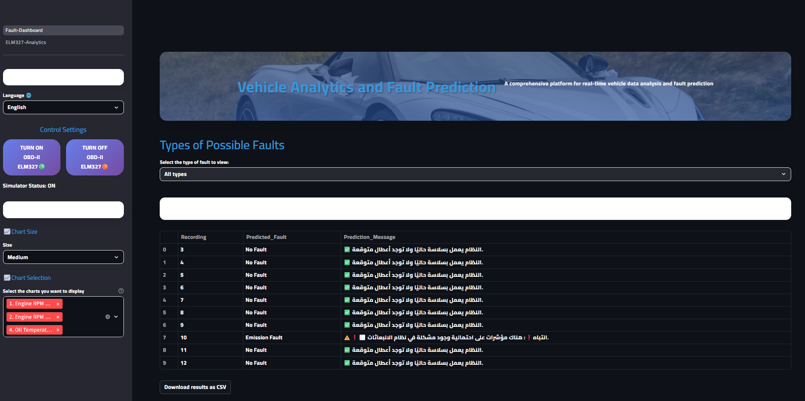
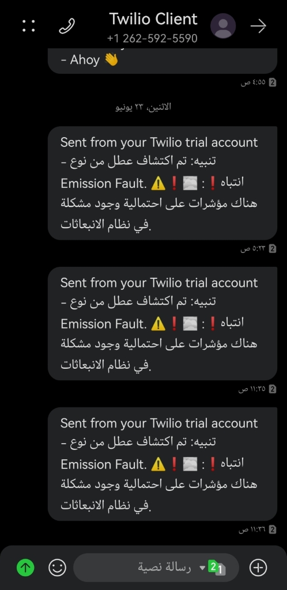

# Car Fault Prediction System





---

## Introduction

This is a complete system for real-time vehicle fault diagnosis using **OBD-II data**, **Machine Learning (XGBoost)**, and **mobile integration**.

- It connects to your car via an **OBD-II ELM327** device.
- It analyzes the data in real time using a trained **machine learning model (XGBoost)**.
- If an issue is detected, it **stores the result**, **displays it on a dashboard**, and **sends an alert to the driver’s phone**.
- The mobile app integrates everything: **dashboard + chatbot assistant** for mechanical inquiries.

---

## Project Structure

```text
AutoDiag-OBD-II/
├── API/                         # Backward-compatible API entrypoint and Dockerfile
├── UI/                          # Backward-compatible Streamlit entrypoints and Dockerfile
├── assets/                      # Project screenshots and visual assets
├── database/                    # Database artifacts
├── docs/                        # Architecture and project documentation
├── models/
│   └── artifacts/               # Trained model and preprocessing artifacts
├── notebooks/                   # Training and experimentation notebooks
├── src/
│   └── car_fault_prediction/
│       ├── api/                 # FastAPI implementation
│       ├── config/              # Centralized paths and environment settings
│       ├── services/            # Prediction and persistence orchestration
│       ├── ui/                  # Streamlit dashboard and analytics pages
│       └── utils/               # Shared preprocessing helpers
├── static/
│   └── chatbot_llm/             # Static chatbot prototype assets
├── tests/                       # Smoke tests
├── .env.example                 # Example environment variables
├── requirements.txt
└── README.md
```

---

## Features

-  **Real-time OBD-II Data Processing**
-  **AI Fault Prediction** using XGBoost classifier
-  **Interactive UI** to visualize sensor data and fault alerts
-  **Fault Database** to store all predictions historically
-  **RESTful API** for integration with any platform
-  **Mobile App with Push Notifications** on fault detection
-  **Built-in Chatbot** for user Q&A and mechanic guidance
-  **Dockerized** for clean deployment and portability

---

##  Model Details

- **Model Type:** `XGBoost Classifier`
- **Task:** Multi-class classification of fault types
- **Input Features:** 16 OBD-II signals (e.g., RPM, Temp, Pressure)
- **Output Classes:** Normal, Engine Fault, Transmission Fault, etc.
- **Preprocessing:** LabelEncoding, Feature Ordering
- **Performance:** 97%+ accuracy on test set

---

## Data Flow Overview

1. OBD-II Data is received from car sensors.
2. Sent to FastAPI via `/predict` endpoint.
3. Processed by prediction service using trained ML model.
4. Results stored in SQLite database.
5. If fault is detected, a **notification is sent to the user's mobile**.
6. Displayed in real-time using Streamlit dashboard.
7. User can chat with the chatbot via mobile app for clarification.

---

## How to Run Locally

### Environment Variables

Copy `.env.example` to `.env` and update values as needed:

- `FASTAPI_URL`
- `OBD_DATABASE_PATH`
- `TWILIO_ACCOUNT_SID`
- `TWILIO_AUTH_TOKEN`
- `TWILIO_MESSAGING_SERVICE_SID`
- `TWILIO_PHONE_NUMBER`

### 1. Clone the Repo

```bash
git clone https://github.com/Tarekys/CAR-FAULT-PREDICTION-OBD-II.git
cd CAR-FAULT-PREDICTION-OBD-II
```

### 2. Install Dependencies

```bash
pip install -r requirements.txt
```

### 3. Run API (FastAPI)

```bash
uvicorn --app-dir API API:app --reload
```

### 4. Run UI (Streamlit)

```bash
streamlit run UI/Fault-Dashboard.py
```

---

## Docker Instructions

### Build and Run API

```bash
docker build -f API/Dockerfile -t obd-api .
docker run -p 8000:8000 obd-api
```

### Build and Run UI

```bash
docker build -f UI/Dockerfile -t obd-ui .
docker run -p 10000:10000 obd-ui
```

### Build and Run Static Chatbot Prototype

```bash
docker build -f static/chatbot_llm/Dockerfile -t obd-chatbot .
docker run -p 8080:80 obd-chatbot
```

---

## References

- Chen, T., & Guestrin, C. (2016). *XGBoost: A Scalable Tree Boosting System*.
- Maklin, C. (2022). *Data Cleaning and Preprocessing for ML*.
- OBD-II Standard Docs

---

## Notes

- The business logic, API behavior, model artifacts, and prediction labels are preserved.
- Legacy launch paths in `API/` and `UI/` remain available through compatibility wrappers.
- The training notebook is retained under `notebooks/` for reference.
